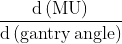
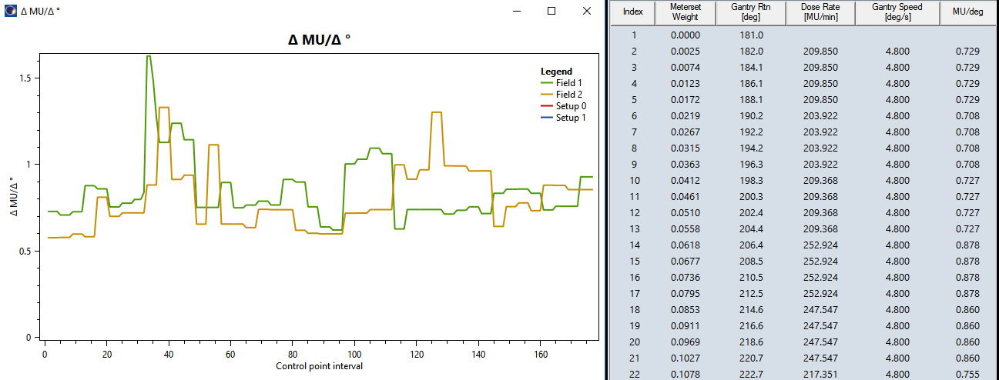

# VarianESAPI-ControlPointsPlot

This script can be used to plot the dose rate against gantry angle for VMAT plans created in the Eclipse treatment planning system.

## How to use the script

Download the content of the *dlls* folder to the directory where you keep your dlls. Register the ControlPointsPlot.esapi.dll file with Eclipse. The script will use [OxyPlot](https://github.com/oxyplot/oxyplot) library to plot this "derivative":

## How to change the script

If you wish to change the script, use the source file (ControlPointsPlot.cs), and add 

* OxyPlot.Core.1.0.0
* OxyPlot.Wpf.1.0.0

to your project. Then recompile. OxyPlot files are not included in the soruce, so you have to do things manually.

